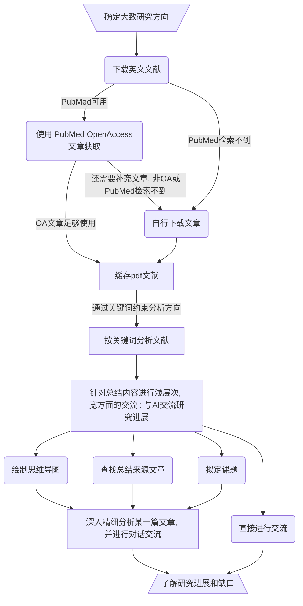

<h1 align="center">
<b>Scholar Navis</b>
</h1>

<i>一款基于 gpt_academic 的流水线式领域进展分析工具</i>

| [简体中文](README.md) | [繁体中文](readme-zh_Hant.md) | [English](readme-en_US.md) |

### 事先说明

本软件基于 gpt_academic（3.83）开发，作为其一款插件执行跨平台任务的前沿分析工具。因为对gpt_academic的源码发生了小幅度修改（主要是使其能够调用 Scholar Navis），为遵守 GNU General Public License v3.0 许可证，本库中亦包含gpt_academic的代码。详细使用情况和修改内容，可以点击[这里](crazy_functions/scholar_navis/doc/zh-Hans/third-party-lisence.md)

### 简单介绍

- 将文献阅读、了解研究领域进展等需求与AI进行整合的一款工具。Scholar Navis 是一款跨平台工具、可以同时分析总结多篇文献、了解该领域的发展现状、认识到这些文章的相似之处、创新点和不足，**并结合自身的知识**，开辟出新的研究方向，在综述的撰写上也有一定的帮助。

- 可以从众多的文章中找到感兴趣的文章，并对这个文章或其他任何文章进行分析，进一步消化吸收该篇文章。

- 可以对单独文章甚至大量文章进行对话，通过问答的形式，与AI讨论研究细节。

- “Navis”在拉丁语中是“**船**”的意思，借助这艘船，开辟前人尚未发现的新大陆吧。

- 除gpt_academic内置的对话、学术功能之外，Scholar Navis 修改或新引入了多项功能。该工具包含有五个工具：[`PubMed OpenAccess文章获取`](crazy_functions/scholar_navis/doc/zh-Hans/PubMed-Open-Access-Articles-Download.md)、[`缓存pdf文献`](crazy_functions/scholar_navis/doc/zh-Hans/Cache-PDF-Articles.md)、[`按关键词分析文献`](crazy_functions/scholar_navis/doc/zh-Hans/Summarize-Articles-by-Keywords.md)、[`与AI交流研究进展`](crazy_functions/scholar_navis/doc/zh-Hans/Communicate-with-AI-about-Research-Progress.md)、[`精细分析文献`](crazy_functions/scholar_navis/doc/zh-Hans/Fine-grained-Analysis-of-Article.md)，这五项功能组成了最主要的分析管线，是scholar navis目前最为重要的工作流，帮助从一个宽泛的研究方向一次性了解多篇文章，再从这些文章中找到更有价值的文章，从中进行了解和学习；自定义语言输出，模型分析过程中使用英语，输出结果时使用目标语言，打破语言壁垒，快速获取重要学术信息；基于大语言模型的本地化多语言支持；自定义提供商、API-KEY、模型功能；为一些需要访问LLM或者是需要文献信息、网络请求的部分，设计了缓存机制，减少因为请求而产生的额外耗时；通过大语言模型的文字理解能力，更好的识别文章的doi、标题；自带文件清理机制，适时删除过期文件。

### 设计初衷

- 让每个人都有低成本、高效率的GPT工具可以用，无需担心网络和其他条件限制。

- 借助开源，基于 [gpt_academic](https://github.com/binary-husky/gpt_academic) 可以实现更多的功能。

- 希望减少一些皮包公司的套壳ChatGPT的使用和泛滥。

- 为尽可能减少AI凭空捏造的现象，选择把上传的文献作为AI分析的最主要依据。

- 使用此工具，可以从确定研究方向开始，流水线式地下载文章，拟定课题，分析当前领域的研究现状和缺口，发掘前人尚未研究的方向，对感兴趣的文章进行精细摘要、对不清楚的地方进行提问并为之解答。

### 工具特色

- 开源。

- 使用简单。每个可能的使用场景均有其对应的帮助文档。

- 支持中文英语双语言显示。（GPT则支持多种语言，<b>不同GPT对不同语言的支持能力有所不同，GPT的理解能力也会有差异</b>）可以使用`multi_language.py`自行翻译gpt_academic。此外，非简体中文语言可能会有无法点击“提交”按钮的问题，此时可以打开`界面外观 -> 浮动输入区`进行暂时性的替代。该问题尚不清楚如何修复。
* 指令化。使用一些特定的指令，实现不同的功能

* 条理化。若干文章的总结分条展示，便于结合自身的经验，考虑新颖的出发点和落脚点

* 效率高、支持中断。将十几篇甚至几十篇文章提供给人工智能是一个耗时的环节，通过分组优化，实现随时中断，下次从中断的文章继续分析。 * 部分功能支持

* 文章寻找便捷。如果对导入的几十篇文章中的几个要点感兴趣，可以询问AI，AI会帮你找出包含该要点的所有文章

* 协助拟定课题。从这些文献中拟定一些有创新性的课题

* 全方面分析文章，分条呈现总结内容。

* 更注重文章的创新性和缺陷。

* 使用缓存，减少访问LLM大语言模型的次数，降低使用成本，加快处理速度

* 支持用户自定义API-KEY（支持OpenAI、智谱、通义千问、深度求索和月之暗面）、自定义OpenAI的URL重定向，支持添加新的模型

* web服务：在线PDF浏览

* API服务：简易维护提醒
- 借助 gpt_academic，得以实现以下功能：
  
  > - 中文友好。对中国大陆进行优化，有完善的中文对话服务，有中文注释，支持网络代理。此外也支持英文。
  > - 无电脑性能要求。由于直接使用在线AI服务，所以并不需要高配置电脑既可以运行，只要能上网就可以用（gpt_academic 也支持本地模型）。
  > - 绘制思维导图。借助 gpt_academic 的插件（生成多种 Mermaid 图表 @Menghuan1918）可以绘制多种类型的思维导图
  > - 通用。使用通用的LLM（大语言模型）即可，无需对模型进行微调。
  > - 可控。AI的分析总结和对话，均基于上传的文章、提供的关键词、提示等可控的内容。
  > - 低成本。使用`deepseek-chat`、`moonshot-v1-8k`、`GLM-4-Flash`、`GLM-4-Air`、`qwen-turbo`、`ChatGPT-3.5 turbo`等价格相对低廉的模型即可完成几乎所有任务，因为他们总结分析的材料均来自您上传的内容，只要AI能够看懂，就可以用。

### 免责声明

* 基于简体中文开发，翻译均为LLM翻译辅之人工修正。如有内容冲突，**一切内容以简体中文版为准**

* 受限于AI的不确定性（就像人一样，有时候会说错话），对部分内容的总结可能不完全甚至不正确，存在理解偏差和翻译出错的可能。

* 即使是相同的文章，使用同一个AI，也有可能分析的结果不同

* 您需要知道的是，LLM（大语言模型）的效果深受训练方式、参数、问答因素的等影响，<b>**输出的内容可能不客观、片面甚至错误**</b>。

* 一些原生英文的AI对于中文（或其他非英语语种）的理解能力可能较差。

* 当生成的内容不太满足要求时，可以尝试重新多试几次。

* 仅作为辅助工具，务必辅以必要的人工检查和处理。<b>**我们不推荐在不加检查、不加修正的情况下，直接采用AI输出的结果。如果发生任何问题，Scholar Navis 作者及其所属组织、语言模型提供服务商、gpt_academic及其有关或衍生内容不负任何责任。**</b>"

* 您需要知道的是，GPLv3提供责任限制（版权人对使用者造成的损失不负任何责任），不提供任何担保（版权人亦不为该软件的品质提供任何担保）。如果使用了本AI服务，则默认同意上述内容，否则请勿使用。

### 安装过程

1. 直接下载本项目，并安装好python。
   
   > 对于windows 10及其以上版本的用户，也可以尝试应用商店中的python。
   > 如果还需要python进行其他开发或运行其他应用，推荐使用conda
   > 如果您在使用linux，相信您有能力自行解决安装中出现的所有问题

2. 确保python正常安装后，运行`setup.py`即可完成配置与安装（通常情况下已经安装完毕）。配置过程中，主要是对于显示语言和GPT偏好语言进行设置（GPT偏好语言在程序中也可以进行选择）

3. 根据需要，自行修改`config_private.py`中的配置内容，尤其是`API_KEY`（含其他提供商的），并将该API所需的模型填写到`AVAIL_LLM_MODELS`中。具体操作说明可以参考[项目配置说明](https://github.com/binary-husky/gpt_academic/wiki/%E9%A1%B9%E7%9B%AE%E9%85%8D%E7%BD%AE%E8%AF%B4%E6%98%8E)

4. 如果您需要将 Scholar Navis 安装到其他 gpt_academic 中，可以将`scholar_navis`文件夹移动到`crazy_functions`中，并运行安装程序`setup.py`；如果安装程序运行异常、或安装后无法正常运行，可以参考对于 `config_private.py` 和 `crazy_functional.py`的修改，自行安装，并手动安装依赖库。

5. 此外，[docs](docs)文件夹中含有 gpt_academic的所有文档，也可以查阅这些文档（或访问[GitHub页面](https://github.com/binary-husky/gpt_academic)），很有帮助！

6. 关于 gpt_academic 的其它语言选择：可以参考 [gpt_academic/multi_language.py](https://github.com/binary-husky/gpt_academic/blob/master/multi_language.py) 或使用其他已经翻译好的 gpt_academic（Scholar Navis 对于 gpt_academic的修改很少，可以轻易的移植）。

7. 也可以使用我们的在线服务。[简体中文版（中国大陆优化）](https://cn.scholarnavis.com/)、[英文版](https://scholarnavis.com/)。二者除了显示语言不同和服务器所在地、线路不同外，其他功能均一致，且均关闭了PubMed OA文章下载功能，且无法上传200MiB以上的文件。

### 使用教程

1. 运行`main.py`启用 gpt_academic，在打开的web的右侧，应当能够看到 Scholar Navis 的5个方块，点击后可以看到使用提示。
   
    

2. 5个插件（[`PubMed OpenAccess文章获取`](crazy_functions/scholar_navis/doc/zh-Hans/PubMed-Open-Access-Articles-Download.md)、[`缓存pdf文献`](crazy_functions/scholar_navis/doc/zh-Hans/Cache-PDF-Articles.md)、[`按关键词分析文献`](crazy_functions/scholar_navis/doc/zh-Hans/Summarize-Articles-by-Keywords.md)、[`与AI交流研究进展`](crazy_functions/scholar_navis/doc/zh-Hans/Communicate-with-AI-about-Research-Progress.md)、[`精细分析文献`](crazy_functions/scholar_navis/doc/zh-Hans/Fine-grained-Analysis-of-Article.md)）其均内置了简洁的操作指南和功能作用，切换到该工具，`辅助指令` -> `help: 帮助文档`即可查看。

3. 作为一种流水线式工具，一般而言的使用流程为（共四大步，每个功能前均有编号）：

3. 如果需要上传文件，通常为先上传再运行某一个功能。
4. 此外，用户也可以在左上角的`API-KEY`中输入自己的密钥，使用其他中转服务商，或者是添加额外的自定义模型。
5. 当然，也可以使用gpt_academic其他的功能进行处理。如果感觉有用，最好可以给原项目一个star！

### 简易开发者文档

**在`crazy_functions\scholar_navis`文件夹中，除了运行 Scholar Navis 正常运行所需的脚本外，还有以下文件(夹)：data、i18n、config.yml和version。使用过程中如果遇到一些问题，或者是其他情况，可以对这里进行调整**

- `data`文件夹内容：
  
  - `pubmedOA_download`：仅用于储存使用内置工具下载的文章，减少不必要的重复下载（当该文件夹中存在名称为PMCID的pdf文件时，则下载器跳过下载，直接使用该缓存）
  
  - `article_doi_title.db`：储存着所有由PubMed下载器、元数据读取、AI辅助获取、正则表达式获取的doi和标题的对应关系。用于在展示文章时，输出文章标题，并提供跳转到文章发布页的功能。当数据库中有储存时，会跳过对doi和title的获取和解析。
  
  - `doi_fulltext_ai_understand.db`：储存着精细分析文章时，AI阅读文章的内容。当精细分析文章的doi命中时，则直接使用缓存的内容，减少访问LLM的次数
  
  - `user_useage_log.db`：记录用户使用日志，仅在`enable_user_usage_log = true`时启用。记录内容包括一些敏感内容，包括用户名、访问ip、使用时间、使用模型名称、调用功能名称（predict通常为普通对话，execute为scholar navis的插件）、用户的prompt和输入内容。

- `i18n`：`gettext`所需的国际化文本（仅限于 Scholar Navis和部分gpt_academic内容，不适用于gpt_academic）。

- `config.yml`：储存着GPT偏好语言和显示语言设定。

- `version`：储存着scholar navis的版本号，与gpt_academic的版本号不同。

**用户上传的文章、分析过程中产生的各类文件和缓存，均储存在`gpt_log`中**

- gpt_academic 支持多用户，如果没有设定用户，则所有的处理均以`default_user`用户进行。
- `gpt_log\ {用户名} \scholar_navis` 中储存着产生的各类总结库。总结库为进行某一领域方向分析的一个单位。
- `cache`文件夹：储存着新导入的、尚未进行预分析（按照指定的关键词分析文章摘要）、未进行总结的文章，但是他们可能已经进行了预处理（即有同名的yml文件，获取doi和标题）。
- `repository`文件夹：储存着所有已经处理完成的文章。
- `summarization.pdf/txt`：储存着按照指定关键词分析的结果。pdf仅用于展示给用户，后续如果需要用到分析结果，只会用`summarization.txt`
- `lib_manifest.yml`：储存着该总结库的名字、关键词和该总结库生成时 Scholar Navis 的版本号。总结库名字应当与所在文件夹一致。
- `unusable_pdf_list.yml`：记录无法使用的文件列表。

**根目录中添加的一些特殊目录和文件**

- `tmp`：scholar navis功能运行过程中产生的临时文件。今后也可能包括其他临时文件

- `notification`：用于制作简易的通知。在内部创建一个`notification.txt`即可把通知内容显示在网页上了，支持html，不支持热更新。

- `web_services`：用于使用一些基于HTML + JS + CSS的服务。目前使用pdf.js作为pdf viewer，提供在线的PDF展示与下载功能。

- `setup.py`：负责在config_private.py、crazy_funcitonal.py中注册scholar navis的工作管线；配置部分多语言选项和语言偏好；配置部分选项；安装依赖（requirements.txt）。支持使用参数调整语言和选项，可以使用  -h 命令查看（仅英文）。

### 版权信息

- Scholar Navis 遵守 GPL-3.0 license 开源许可证

- 因为对gpt_academic产生了修改，根据 GPL-3.0 许可证的要求，亦需要发布修改后的源码，并注明修改的内容。

- Scholar Navis 引用的所有第三方库及其许可证信息，对gpt_academic的修改和使用，以及更加详细的版权声明，可以看[这里](crazy_functions/scholar_navis/doc/zh-Hans/third-party-lisence.md)
