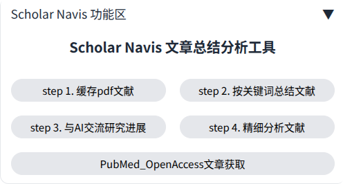

<h1 align="center">
<b>Scholar Navis</b>
</h1>

<i>一款基于 gpt_academic 的流水线式领域进展分析工具</i>

| [简体中文](README.md) | [繁体中文](readme-zh_Hant.md) | [English](readme-en_US.md) |

### 事先说明

本软件基于 gpt_academic（3.83）开发，为其衍生作品。遵守 GNU General Public License v3.0 许可证。详细使用情况和修改内容，可以点击[这里](crazy_functions/scholar_navis/doc/zh-Hans/third-party-lisence.md)

### 简单介绍

- 将文献阅读、了解研究领域进展等需求与AI进行整合的一款工具。Scholar Navis 是一款跨平台工具、可以同时分析总结多篇文献、了解该领域的发展现状、认识到这些文章的相似之处、创新点和不足，**并结合自身的知识**，开辟出新的研究方向，在综述的撰写上也有一定的帮助。

- 可以从众多的文章中找到感兴趣的文章，并对这个文章或其他任何文章进行分析，进一步消化吸收该篇文章。

- 可以对单独文章甚至大量文章进行对话，通过问答的形式，与AI讨论研究细节。

- “Navis”在拉丁语中是“**船**”的意思，借助这艘船，开辟前人尚未发现的新大陆吧。

- 除gpt_academic内置的对话、学术功能之外，Scholar Navis 修改或新引入了多项功能。该工具包含有五个工具：[`PubMed OpenAccess文章获取`](crazy_functions/scholar_navis/doc/zh-Hans/PubMed-Open-Access-Articles-Download.md)、[`缓存pdf文献`](crazy_functions/scholar_navis/doc/zh-Hans/Cache-PDF-Articles.md)、[`按关键词分析文献`](crazy_functions/scholar_navis/doc/zh-Hans/Summarize-Articles-by-Keywords.md)、[`与AI交流研究进展`](crazy_functions/scholar_navis/doc/zh-Hans/Communicate-with-AI-about-Research-Progress.md)、[`精细分析文献`](crazy_functions/scholar_navis/doc/zh-Hans/Fine-grained-Analysis-of-Article.md)，这五项功能组成了最主要的分析管线，是scholar navis目前最为重要的工作流，帮助从一个宽泛的研究方向一次性了解多篇文章，再从这些文章中找到更有价值的文章，从中进行了解和学习；自定义语言输出，模型分析过程中使用英语，输出结果时使用目标语言，打破语言壁垒，快速获取重要学术信息；基于大语言模型的本地化多语言支持；自定义提供商、API-KEY、模型功能；为一些需要访问LLM或者是需要文献信息、网络请求的部分，设计了缓存机制，减少因为请求而产生的额外耗时；通过大语言模型的文字理解能力，更好的识别文章的doi、标题；自带文件清理机制，适时删除过期文件。

- 此外，Scholar Navis 也有`摘取有用语句`功能，使用它可以很方便的从大量文章中摘取符合自己要求的语句（并提供翻译，便于阅读），对撰写摘要、综述和资料收集方面很有帮助。

### 设计初衷

- 让每个人都有低成本、高效率的GPT工具可以用，无需担心网络和其他条件限制。

- 借助开源，基于 [gpt_academic](https://github.com/binary-husky/gpt_academic) 可以实现更多的功能。

- 希望减少一些皮包公司的套壳ChatGPT的使用和泛滥。

- 为尽可能减少AI凭空捏造的现象，选择把上传的文献作为AI分析的最主要依据。

- 使用此工具，可以从确定研究方向开始，流水线式地下载文章，拟定课题，分析当前领域的研究现状和缺口，发掘前人尚未研究的方向，对感兴趣的文章进行精细摘要、对不清楚的地方进行提问并为之解答。

### 工具特色

- 开源。

- 使用简单。每个可能的使用场景均有其对应的帮助文档。

- 支持中文英语双语言显示。（GPT则支持多种语言，<b>不同GPT对不同语言的支持能力有所不同，GPT的理解能力也会有差异</b>）
* 指令化。使用一些特定的指令，实现不同的功能

* 条理化。若干文章的总结分条展示，便于结合自身的经验，考虑新颖的出发点和落脚点

* 效率高、支持中断。将十几篇甚至几十篇文章提供给人工智能是一个耗时的环节，通过分组优化，实现随时中断，下次从中断的文章继续分析。 * 部分功能支持

* 文章寻找便捷。如果对导入的几十篇文章中的几个要点感兴趣，可以询问AI，AI会帮你找出包含该要点的所有文章

* 协助拟定课题。从这些文献中拟定一些有创新性的课题

* 全方面分析文章，分条呈现总结内容。

* 更注重文章的创新性和缺陷。

* 使用缓存，减少访问LLM大语言模型的次数，降低使用成本，加快处理速度

* 支持用户自定义API-KEY（支持OpenAI、智谱、通义千问、深度求索和月之暗面）、自定义OpenAI的URL重定向，支持添加新的模型

* web服务：在线PDF浏览

* API服务：简易维护提醒
- 借助 gpt_academic，得以实现以下功能：
  
  > - 中文友好。对中国大陆进行优化，有完善的中文对话服务，有中文注释，支持网络代理。此外也支持英文。
  > - 无电脑性能要求。由于直接使用在线AI服务，所以并不需要高配置电脑既可以运行，只要能上网就可以用（gpt_academic 也支持本地模型）。
  > - 绘制思维导图。借助 gpt_academic 的插件（生成多种 Mermaid 图表 @Menghuan1918）可以绘制多种类型的思维导图
  > - 通用。使用通用的LLM（大语言模型）即可，无需对模型进行微调。
  > - 可控。AI的分析总结和对话，均基于上传的文章、提供的关键词、提示等可控的内容。
  > - 低成本。使用`deepseek-chat`、`moonshot-v1-8k`、`GLM-4-Flash`、`GLM-4-Air`、`qwen-turbo`、`ChatGPT-3.5 turbo`等价格相对低廉的模型即可完成几乎所有任务，因为他们总结分析的材料均来自您上传的内容，只要AI能够看懂，就可以用。

### 免责声明

* 基于简体中文开发，翻译均为LLM翻译辅之人工修正。如有内容冲突，**一切内容以简体中文版为准**

* 受限于AI的不确定性（就像人一样，有时候会说错话），对部分内容的总结可能不完全甚至不正确，存在理解偏差和翻译出错的可能。

* 即使是相同的文章，使用同一个AI，也有可能分析的结果不同

* 您需要知道的是，LLM（大语言模型）的效果深受训练方式、参数、问答因素的等影响，<b>**输出的内容可能不客观、片面甚至错误**</b>。

* 一些原生英文的AI对于中文（或其他非英语语种）的理解能力可能较差。

* 当生成的内容不太满足要求时，可以尝试重新多试几次。

* 仅作为辅助工具，务必辅以必要的人工检查和处理。<b>**我们不推荐在不加检查、不加修正的情况下，直接采用AI输出的结果。如果发生任何问题，Scholar Navis 作者及其所属组织、语言模型提供服务商、gpt_academic及其有关或衍生内容不负任何责任。**</b>"

* 您需要知道的是，GPLv3提供责任限制（版权人对使用者造成的损失不负任何责任），不提供任何担保（版权人亦不为该软件的品质提供任何担保）。如果使用了本AI服务，则默认同意上述内容，否则请勿使用。

### 安装过程

#### 直接安装

1. 直接下载本项目，并安装好python。
   
   > 对于windows 10及其以上版本的用户，也可以尝试应用商店中的python。
   > 如果还需要python进行其他开发或运行其他应用，推荐使用conda
   > 如果您在使用linux，相信您有能力自行解决安装中出现的所有问题

2. 确保python正常安装后，根据`requirements.txt`完成安装（通常使用命令 `pip install -r requirements.txt` 实现。

#### Docker 安装

        待补充...

#### 配置

1. 根据需要，自行修改`config_private.py`中的配置内容，或者是使用同名的环境变量进行配置。读取优先级：环境变量 ＞ config_private.py ＞ config.py。config.py在每次更新时可能被覆盖，不推荐在此文件中修改配置。

2. 此外，[docs](docs)文件夹中含有 gpt_academic的所有文档，也可以查阅这些文档（或访问[GitHub页面](https://github.com/binary-husky/gpt_academic)），很有帮助！

3. 也可以使用我们的在线服务。[简体中文版（中国大陆优化）](https://cn.scholarnavis.com/)、[英文版](https://scholarnavis.com/)。二者除了显示语言不同和服务器所在地、线路不同外，其他功能均一致。

### 使用教程

#### 对话部分

1. 运行`main.py`启用 gpt_academic，在打开的web的右侧，应当能够看到 Scholar Navis 的5个方块，点击后可以看到使用提示。
   
    

2. 5个插件（[`PubMed OpenAccess文章获取`](crazy_functions/scholar_navis/doc/zh-Hans/PubMed-Open-Access-Articles-Download.md)、[`缓存pdf文献`](crazy_functions/scholar_navis/doc/zh-Hans/Cache-PDF-Articles.md)、[`按关键词分析文献`](crazy_functions/scholar_navis/doc/zh-Hans/Summarize-Articles-by-Keywords.md)、[`与AI交流研究进展`](crazy_functions/scholar_navis/doc/zh-Hans/Communicate-with-AI-about-Research-Progress.md)、[`精细分析文献`](crazy_functions/scholar_navis/doc/zh-Hans/Fine-grained-Analysis-of-Article.md)）其均内置了简洁的操作指南和功能作用，切换到该工具，`辅助指令` -> `help: 帮助文档`即可查看。

3. 作为一种流水线式工具，一般而言的使用流程为（共四大步，每个功能前均有编号）：

3. 如果需要上传文件，通常为先上传再运行某一个功能。
4. 此外，用户也可以在左上角的`API-KEY`中输入自己的密钥，使用其他中转服务商，或者是添加额外的自定义模型。
5. 当然，也可以使用gpt_academic其他的功能进行处理。如果感觉有用，最好可以给原项目一个star！

#### 摘取有用语句

1. 页面中有较为详细的教程文字。通常情况下，上传PDF（或PDF压缩包，可选）、上传额外的PDF（或压缩包）、设定好针对摘取句子时的内容要求、设定好结构要求（可以理解成满足内容要求的文本，在行文上的要求）、翻译语言和最大并行数，即可执行。

2. 运行过程中，会不断输出日志，当任务尚未结束时，日志会有动画指示。

3. 下载文件时，通常下载结果文件即可。

4. 当需要再次运行时，需要先重置。

### 开发者文档

        待补充...

### 版权信息

- Scholar Navis 遵守 GPL-3.0 license 开源许可证

- 因为对gpt_academic产生了修改，根据 GPL-3.0 许可证的要求，亦需要发布修改后的源码，并注明修改的内容。

- Scholar Navis 引用的所有第三方库及其许可证信息，对gpt_academic的修改和使用，以及更加详细的版权声明，可以看[这里](crazy_functions/scholar_navis/doc/zh-Hans/third-party-lisence.md)

- 在web界面中， Scholar Naivs 功能可以使用辅助指令`license`查看许可证和其他第三方版权信息与gpt_academic修改信息；也可以使用`about`查看关于文档
