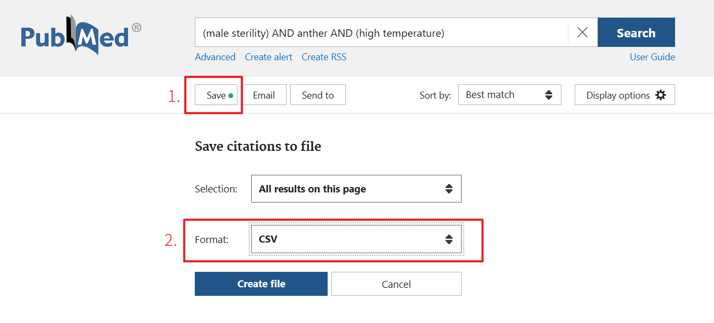

这是 Scholar Navis 的附属工具。该工具允许您使用API的方式，从PubMed的FTP上批量下载Open Access文章。

下载完成后，可以进行其他有关的工作，也可以使用 Scholar Navis 的工作流进行前沿分析。

 Scholar Navis 通过访问<a href="https://www.ncbi.nlm.nih.gov/pmc/tools/oa-service/" target="_blank">OA Web Service API</a>获取OA文章的位置，并访问<a href="https://www.ncbi.nlm.nih.gov/pmc/tools/ftp/" target="_blank">FTP Service</a>下载PMC Open Access Subset Only。

------------

PubMed对于自动化检索的声明如下：

> The PMC Cloud Service, PMC OAI-PMH Service, PMC FTP Service, E-Utilities and BioC API are the only services that may be used for automated retrieval of PMC content. Systematic retrieval (or bulk retrieval) of articles through any other automated process is prohibited.

`PMC FTP Service`是被允许进行自动化检索PMC内容的。在`PMC FTP Service`的用户手册中，有如下的使用方法：

> If you only want to download some of the [PMC OA Subset](https://www.ncbi.nlm.nih.gov/pmc/tools/openftlist/) based on search criteria or if you want to download complete packages for articles that include XML, PDF, media, and supplementary materials, you will need to use the individual article download packages. To keep directories from getting too large, the packages have been randomly distributed into a two-level-deep directory structure. You can use the file lists in CSV or txt format to search for the location of specific files or you can use the [OA Web Service API](https://www.ncbi.nlm.nih.gov/pmc/tools/oa-service/). The file lists and OA Web Service API also provide basic article metadata.

我们可以使用`OA Web Service API`获取某篇文章在FTP中的位置，并通过FTP服务进行下载。在`OA Web Service API`的文档中，有声明如下内容：

> The PMC OA Web Service API allows users to discover downloadable resources from the [PMC Open Access Subset](https://www.ncbi.nlm.nih.gov/pmc/tools/openftlist/). These articles are available for download from our [FTP site](https://www.ncbi.nlm.nih.gov/pmc/tools/ftp/) in tgz (tar'd, gzipped) format, or, for those articles that have them, in PDF format as well.
> 
> This API allows discovery of resources related to articles. For example, it can be used to find the PDFs of all articles that have been updated since a specified date. This could facilitate implementing tools that reuse the OA subset content, such as mirror sites, text mining processes, etc.

即我们可以通过`OA Web Service API`获取文章资源，并通过`PMC FTP Service`下载此文章。

请勿通过直扒取网页等不合法的方式批量获取文章，这样子做是不允许的。如果您担心会被封禁，请勿使用此功能。

---------------------

 

**以下为操作步骤（按顺序执行）：**

 

1. **PubMed检索文章**

按照通常方法进行检索即可。

 

2. **获取csv**

- 点击 `save` 弹出 `Save citations to file`，Format选择 CSV；Selection根据自身需要、检索结果选择即可（如果不清楚选择什么，可以选择All results）

- 之后点击`Create file`下载，就得到了需要的csv文件

 

3. **配置网络代理（可选）**

在<a href="https://github.com/binary-husky/gpt_academic" target="_blank">GPT Academic</a> 的 config_private.py 中配置您的代理。如果希望使用其他更快的线路访问，请配置此选项。

 

4. **使用 Scholar Navis 进行批量下载**

上传 csv 后，运行该功能即可。

| 项目        | 输入提示                   |
| --------- | ---------------------- |
| 上传保存的文章列表 | 通常已经自动填写。内容是刚刚上传的文件的路径 |
| 辅助指令      | 默认即可（选择：无）             |

 

5. **处理下载结果**
- 下载完成后，会显示下载成功文章和下载失败的文章列表，这里可以直接跳转到对应的PubMed界面，自行手动检索或下载。（下载失败的原因也会显示）

- 下载后的文章会被保存在`crazy_functions\scholar_navis\data\pubmedOA_download`中。此外，已经下载过的文章不会再次下载（需要保持文件名不发生变化），而是直接使用下载完成的文章，即使是中断后重新启用下载也是如此。

- 可以找到`点击获取下载的文章`以下载`pubmed_openaccess_download.zip`和`点击获取下载日志`以下载`download_log.log`。
  
  - `pubmed_openaccess_download.zip`：所有批量下载完成的文章，点击即可获取。Scholar Navis 支持直接使用该压缩包进行分析，上传该压缩包即可。也可以自行查阅压缩包内的文章，进行其他的文献阅读任务。
  
  - `download_log.log`：本次下载任务的日志，较为详细的记录了下载日期、PMID、PMCID、下载状态和下载信息。
