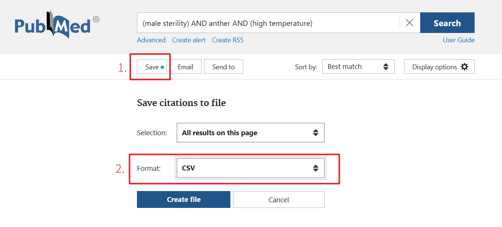

這是 Scholar Navis 的附屬工具。該工具允許您以 API 的方式，從 PubMed 的 FTP 上批量下載 Open Access 文章。

下載完成後，可以進行其他有關的工作，也可以使用 Scholar Navis 的工作流程進行前沿分析。

 Scholar Navis 透過訪問<a href="https://www.ncbi.nlm.nih.gov/pmc/tools/oa-service/" target="_blank">OA Web Service API</a>獲取 OA 文章的位置，並訪問<a href="https://www.ncbi.nlm.nih.gov/pmc/tools/ftp/" target="_blank">FTP Service</a>下載PMC Open Access Subset Only。

---------------------------

PubMed對於自動化檢索的聲明如下：

>  The PMC Cloud Service, PMC OAI-PMH Service, PMC FTP Service, E-Utilities and BioC API are the only services that may be used for automated retrieval of PMC content. Systematic retrieval (or bulk retrieval) of articles through any other automated process is prohibited.

`PMC FTP Service` 是被允許進行自動化檢索 PMC 內容的。在 `PMC FTP Service` 的用戶手冊中，有如下的使用方法：

> If you only want to download some of the [PMC OA Subset](https://www.ncbi.nlm.nih.gov/pmc/tools/openftlist/) based on search criteria or if you want to download complete packages for articles that include XML, PDF, media, and supplementary materials, you will need to use the individual article download packages. To keep directories from getting too large, the packages have been randomly distributed into a two-level-deep directory structure. You can use the file lists in CSV or txt format to search for the location of specific files or you can use the [OA Web Service API](https://www.ncbi.nlm.nih.gov/pmc/tools/oa-service/). The file lists and OA Web Service API also provide basic article metadata.

我們可以使用 `OA Web Service API` 獲取某篇文章在 FTP 中的位置，並通過 FTP 服務進行下載。在 `OA Web Service API` 的文檔中，有如下聲明內容： 

> The PMC OA Web Service API allows users to discover downloadable resources from the [PMC Open Access Subset](https://www.ncbi.nlm.nih.gov/pmc/tools/openftlist/). These articles are available for download from our [FTP site](https://www.ncbi.nlm.nih.gov/pmc/tools/ftp/) in tgz (tar'd, gzipped) format, or, for those articles that have them, in PDF format as well.
> 
> This API allows discovery of resources related to articles. For example, it can be used to find the PDFs of all articles that have been updated since a specified date. This could facilitate implementing tools that reuse the OA subset content, such as mirror sites, text mining processes, etc.  

即我們可以通過 `OA Web Service API` 獲取文章資源，並通過 `PMC FTP Service` 下載此文章。  

請勿通過直接扒取網頁等不合法的方式批量獲取文章，這樣做是不允許的。如果您擔心會被封禁，請勿使用此功能。   

------------

 

**以下為操作步驟（按順序執行）：**

 

1. **PubMed檢索文章**

按照通常方法進行檢索即可。

 

2. **獲取csv**

- 點擊 `save` 標籤，會彈出 `Save citations to file` 視窗，Format選擇 CSV；Selection根據自身需求、檢索結果選擇即可（如果不清楚選擇什麼，可以選擇 All results）

- 之後點擊 `Create file` 下載，就得到了需要的 csv 文件

 

3. **配置網絡代理（可選）**

在<a href="https://github.com/binary-husky/gpt_academic" target="_blank">GPT Academic</a> 的 config_private.py 中配置您的代理。如果希望使用其他更快的线路訪問，請配置此選項。  

 

4. **使用 Scholar Navis 進行批量下載**

上傳 csv 後，運行該功能即可。

| 项目        | 输入提示                   |
| --------- | ---------------------- |
| 上傳保存的文章清單 | 通常已經自動填寫。內容是剛剛上傳的文件的路徑 |
| 輔助指令      | 默认即可（選擇：無）             |

 

5. **處理下載結果**
- 下載完成後，會顯示下載成功文章和下載失敗的文章列表，這裡可以直接跳轉到對應的 PubMed 界面，自行手工檢索或下載。（下載失敗的原因也會顯示） 

- 下載後的文章會被保存在 `crazy_functions\scholar_navis\data\pubmedOA_download` 中。此外，已經下載過的文章不會再次下載（需要保持文件名不變化），而是直接使用下載完成的文章，即使是中斷後重新啟用下載也是如此。

- 可以找到`點擊以取得下載之文章`以下載`pubmed_openaccess_download.zip`，以及`點擊以獲取下載日誌`以下載`download_log.log`。
  
  - `pubmed_openaccess_download.zip`：所有批量下載完成的文章，點擊即可獲取。Scholar Navis 支持直接使用該壓縮包進行分析，上傳該壓縮包即可。也可以自行檢查壓縮包內的文章，進行其他的文獻閱讀任務。
  
  - `download_log.log`：本次下載任務的日誌，較為詳細地記錄了下載日期、PMID、PMCID、下載狀態和下載信息。
