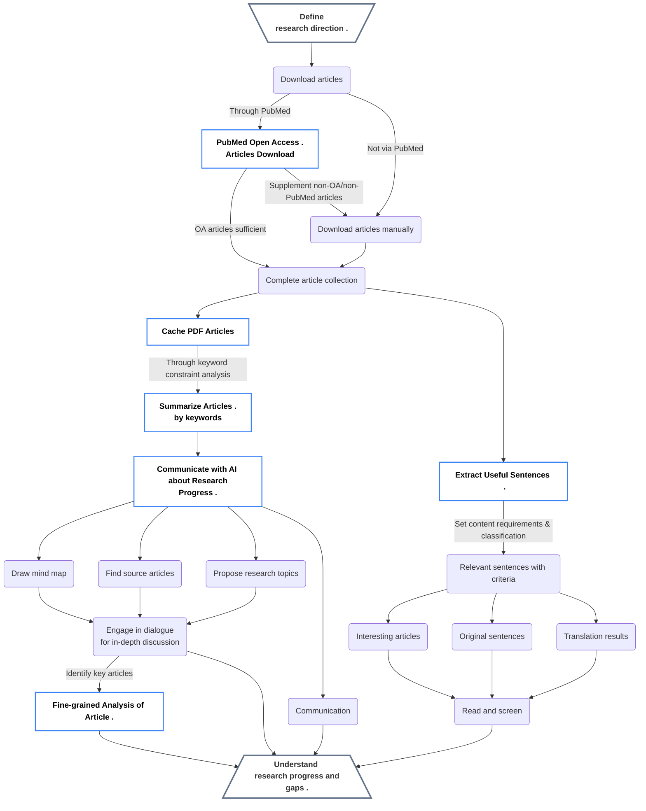

<h1 align="center">
<b>Scholar Navis</b>
</h1>

<i>
A pipeline-based research progress analysis tool based on gpt_academic</i>

| [简体中文](README.md) | [繁体中文](readme-zh_Hant.md) | [English](readme-en_US.md) |

### Pre-announcement

This software is developed based on gpt_academic (3.83) and is considered a derivative work. It is compliant with the GNU Affero General Public License v3.0. For detailed information on usage and modifications, please click [here](crazy_functions/scholar_navis/doc/en-US/third-party-lisence.md)

### Brief Introduction

- This tool integrates literature reading and understanding of research field progress with AI, providing a solution that, unlike commercial tools on the market, can complete more precise analysis at a lower cost. Scholar Navis is a cross-platform tool that can simultaneously analyze and summarize multiple documents, understand the current state of development in the field, recognize the similarities, the innovative points and shortcomings of these articles, **and combining one's own knowledge**,pioneer new research directions. It also provides some assistance in the writing of reviews.

- Find interesting articles among numerous documents and analyze these articles or any other articles, further digesting and absorbing the content of the article.

- Engage in dialogue with individual articles, even with large volumes of them, by means of Q&A sessions, discussing research details with the AI.

- Processes uploaded articles to minimize the acquisition of external erroneous information, and within the capabilities of the LLM model, strives to maximize the accuracy of analysis and dialogue.

- "Navis" in Latin means "**ship**." With this ship, chart new lands that have not been discovered by predecessors.

- In addition to the built-in conversation and academic functions of gpt_academic, Scholar Navis has modified or introduced several new features. The tool includes five tools:[`PubMed Open Access Articles Download`](crazy_functions/scholar_navis/doc/en-US/PubMed-Open-Access-Articles-Download.md), [`Cache PDF Articles`](crazy_functions/scholar_navis/doc/en-US/Cache-PDF-Articles.md), [`Summarize Articles by Keywords`](crazy_functions/scholar_navis/doc/en-US/Summarize-Articles-by-Keywords.md), [`Communicate with AI about Research Progress`](crazy_functions/scholar_navis/doc/en-US/Communicate-with-AI-about-Research-Progress.md), and [`Fine-grained Analysis of Article`](crazy_functions/scholar_navis/doc/en-US/Fine-grained-Analysis-of-Article.md). These five features make up the main analysis pipeline, which is currently the most important workflow for Scholar Navis, helping to understand multiple articles at once from a broad research direction, and then find more valuable articles among them for understanding and learning; customizable language output, using English during the model analysis process and the target language for output, breaking down language barriers, and quickly obtaining important academic information; localized multilingual support based on large language models; customizable providers, API-KEYs, and model functions; designed a caching mechanism for parts that require access to LLMs or need literature information and network requests to reduce additional time spent on requests; better identification of article DOIs and titles through the text comprehension capabilities of large language models; includes a file cleanup mechanism to delete expired files in a timely manner.

- Additionally, Scholar Navis features a `Extract Useful Sentences` function, which allows users to conveniently extract sentences that meet their requirements from a large number of articles (and provides translations for easier reading). This is particularly helpful for writing summaries, reviews, and collecting materials.

### Design Intent

- To make it possible for everyone to have access to a low-cost, high-efficiency GPT tool without worrying about network or other constraints.

- By open source, more functionalities can be achieved based on [gpt_academic](https://github.com/binary-husky/gpt_academic).

- The goal is to reduce the use and spread of ChatGPT clones by shell companies.

- To minimize the phenomenon of AI making things up out of thin air, the choice is made to use uploaded literature as the primary basis for AI analysis.

- With this tool, one can start from determining the research direction, proceed with a streamlined process of downloading articles, formulating research topics, analyzing the current state and gaps in the field, uncovering areas that have not been studied by predecessors, and making detailed summaries of interesting articles. It also allows for asking questions about unclear points and providing answers for them.

### Tool Features

- Open source.

- User-friendly. Each possible use scenario has its corresponding help document.

- Supports both Chinese and English languages. (GPT supports multiple languages, **but the ability to understand different languages may vary among different GPTs** ) . 

- Command-based. Specific commands can be used to achieve different functions.

- Organized. Summaries of several articles are displayed in a tabular format, making it easier to consider new starting and landing points based on personal experience.

- Efficient and supports interruption. The process of providing a large number of articles to an AI for analysis can be time-consuming. Through optimized grouping, it is possible to interrupt at any time and continue from where the analysis was paused. * Some features support this

- Convenient article search. If interested in several key points in the dozens of articles imported, the AI can help find all articles containing those points.

- Helps formulate topics. From these literature, innovative topics can be formulated.

- Provides a comprehensive analysis of articles, presenting summaries in a tabular format.

- Places more emphasis on the innovativeness and deficiencies of articles.

- Uses caching to reduce the number of times the LLM large language model is accessed, lowering costs and speeding up processing.

- Supports user-defined API-KEY (compatible with OpenAI, ZhiPu, TongYi QianWen, DeepSeek, and Moonshot), custom OpenAI URL redirection, and allows the addition of new models.

- Web service: Online PDF viewing

- API service: Easy maintenance reminder

- Utilizes gpt_academic to achieve the following functions:
  
  > - Chinese-friendly. Optimized for mainland China, with comprehensive Chinese dialogue services, Chinese annotations, and support for network proxy. It also supports English.
  > - No computer performance requirements. Since it directly uses online AI services, it does not require a high-performance computer to run and can be used as long as there is internet access (gpt_academic also supports local models).
  > - Drawing mind maps. With the help of the gpt_academic plugin (generating various Mermaid charts @Menghuan1918), various types of mind maps can be created.
  > - Universal. General-purpose LLMs (large language models) can be used without the need for fine-tuning the model.
  > - Controllable. The analysis and summary of AI, as well as the dialogue, are based on the uploaded articles, provided keywords, and prompts, making them controllable.
  > - Low cost. Using models such as `deepseek-chat`, `moonshot-v1-8k`, `GLM-4-Flash`, `GLM-4-Air`, `qwen-turbo`, and `ChatGPT-3.5 turbo`, which are relatively inexpensive, can complete almost all tasks. This is because they summarize and analyze materials from the content you upload, and as long as the AI can understand it, it can be used.

### Disclaimer

* Developed in Simplified Chinese, all translations are performed by the LLM (Large Language Model) and supplemented with manual corrections. In case of any content discrepancies, **the Simplified Chinese version shall be considered as the authoritative**.
- Due to the uncertainty of AI (just like humans, sometimes it may say the wrong thing), the summary of some content may be incomplete or incorrect, with potential for misunderstandings and translation errors.

- Even with the same article and the same AI, the analysis results may vary.

- You should be aware that the effectiveness of LLMs is greatly influenced by training methods, parameters, and question-answering factors, and <b>****the generated content may not be objective, one-sided, or even incorrect****</b>.

- Some AI that natively operates in English may have a poor understanding of Chinese (or other non-English languages).

- If the generated content does not meet your requirements, you can try running the process multiple times.

- Some features may require multiple requests to the model. Please ensure that the model has a relatively lenient rate limit and that your balance is sufficient.

- This tool is intended to be used as an aid and must be supplemented with necessary manual checks and processing.<b>****We do not recommend using the results directly without any checks or corrections. If any issues arise, the authors of Scholar Navis, their affiliated organizations, the language model service providers, gpt_academic, and any related or derivative content are not liable for any responsibility.****</b>

- **The information security of connected systems cannot be fully guaranteed. It is best used by individuals or within small organizations, ensuring the service providers are trustworthy. It is advised not to upload sensitive information. Additionally, when enabling the login feature, the service provider may store your API key. It is not recommended to use unknown or untrusted service providers.**

- What you need to know is that AGPLv3 provides limitation of liability (the copyright holder is not liable for any damages caused to the user) and does not provide any warranty (the copyright holder also does not warrant the quality of the software). By using this AI service, you are deemed to agree to the aforementioned terms; otherwise, please do not use it.

### Install

#### Direct Installation

1. Directly download this project and install Python.
   
   > For users of Windows 10 and above, you can also try Python from the Microsoft Store.
   > If you need Python for other development or to run other applications, it is recommended to use Conda.
   > If you are using Linux, you should be able to resolve any installation issues on your own.

2. After ensuring Python is properly installed, complete the installation based on `requirements.txt` (typically achieved using the command `pip install -r requirements.txt`).

#### Docker Installation

        To be continued...

#### Configuration

1. Modify the settings in `config_private.py` as needed, or use environment variables with the same names for configuration. The priority for reading configurations is: Environment Variables > config_private.py > config.py. The config.py file may be overwritten during updates, so it is not recommended to modify configurations in this file.

2. Additionally, the [docs](docs) folder contains all the documentation for gpt_academic, and you can also refer to these documents (or visit the [GitHub page](https://github.com/binary-husky/gpt_academic)), which are very helpful!

3. You can also use our online service. [Simplified Chinese Version (Optimized for Mainland China)](https://cn.scholarnavis.com/)、[English Version](https://scholarnavis.com/). Both versions are identical in terms of functionality, with the only differences being the display language and the location of the servers and the routes. 

### User Guide

#### Conversation Section

1. Run `main.py` to enable gpt_academic, and on the right side of the opened web page, you should see five blocks of Scholar Navis. Clicking on them will display usage tips.
   
    

2. There are 6 plugins ([`PubMed Open Access Articles Download`](crazy_functions/scholar_navis/doc/en-US/PubMed-Open-Access-Articles-Download.md), [`Cache PDF Articles`](crazy_functions/scholar_navis/doc/en-US/Cache-PDF-Articles.md), [`Summarize Articles by Keywords`](crazy_functions/scholar_navis/doc/en-US/Summarize-Articles-by-Keywords.md), [`Communicate with AI about Research Progress`](crazy_functions/scholar_navis/doc/en-US/Communicate-with-AI-about-Research-Progress.md), [ `Fine-grained Analysis of Article`](crazy_functions/scholar_navis/doc/en-US/Fine-grained-Analysis-of-Article.md) and `Extract useful Sentences`) each of which comes with a simple operation guide and function description. To switch to the tool, go to `Auxiliary Commands` -> `help: help document` to view it.

3. Typically, if you need to upload a file, you would upload it before running a specific feature.

4. In addition, users can also enter their own key in the `API-KEY` at the upper left corner, use other relay service providers, or add additional custom models. 

5. Of course, you can also use other features of gpt_academic to process it. If you find it useful, it's best to give the original project a star!

#### Extract Useful Sentences

1. Using this feature allows you to quickly extract desired original sentences and their translations from a large number of articles, making it easier to compile and write content.

2. The page contains detailed tutorial text. Typically, uploading a PDF (or a PDF zip file, optional), uploading additional PDFs (or zip files), setting content requirements for sentence extraction, setting structural requirements (which can be understood as the stylistic requirements for text that meets the content requirements), selecting the translation language, and setting the maximum parallelism will allow execution.

3. During operation, logs are continuously output. When the task is not yet completed, the logs will have an animation indicator.

4. When downloading files, usually downloading the result file is sufficient.

5. When needing to run again, a reset is required first.

#### Functional Relationship Diagram

### Developer Documentation

        To be continued...

### Copyright Information

- Scholar Navis is distributed under the AGPL-3.0 open source license. 

- Because modifications have been made to gpt_academic, it is also necessary to release the modified source code and clearly note the modifications, in accordance with the requirements of the GPL-3.0 license.

- The third-party libraries referenced by Scholar Navis, their license information, the modifications made to gpt_academic, and a more detailed copyright statement can be viewed [here](crazy_functions/scholar_navis/doc/en-US/third-party-lisence.md).

- In the web interface, the Scholar Naivs feature can use the auxiliary command `license` to view license and other third-party copyright information, as well as modifications to gpt_academic; it can also use `about` to view information about the document.
