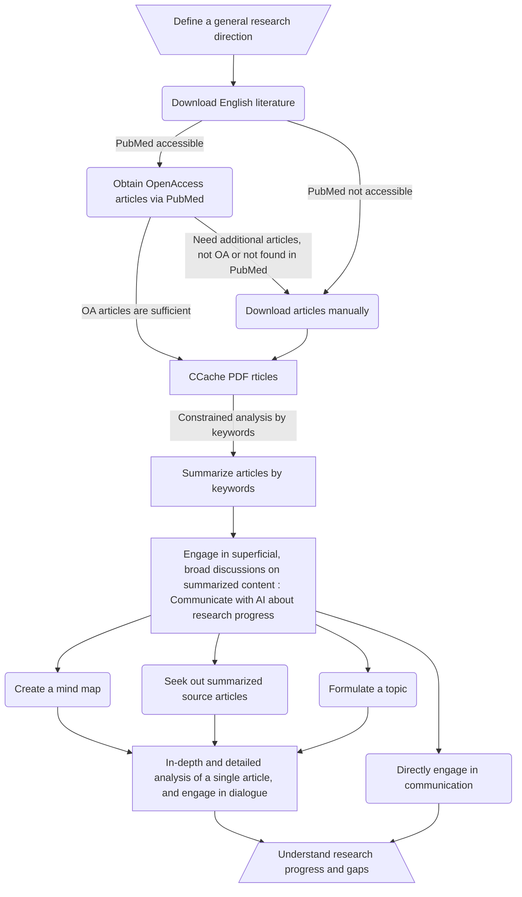

<h1 align="center">
<b>Scholar Navis</b>
</h1>

<i>
A pipeline-based research progress analysis tool based on gpt_academic</i>

| [简体中文](README.md) | [繁体中文](readme-zh_Hant.md) | [English](readme-en_US.md) |

### Pre-announcement

This software is developed based on gpt_academic (3.83) and is considered a derivative work. It is compliant with the GNU General Public License v3.0. For detailed information on usage and modifications, please click [here](crazy_functions/scholar_navis/doc/en-US/third-party-lisence.md)

### Brief Introduction

- This tool integrates literature reading and understanding of research field progress with AI, providing a solution that, unlike commercial tools on the market, can complete more precise analysis at a lower cost. Scholar Navis is a cross-platform tool that can simultaneously analyze and summarize multiple documents, understand the current state of development in the field, recognize the similarities, the innovative points and shortcomings of these articles, **and combining one's own knowledge**,pioneer new research directions. It also provides some assistance in the writing of reviews.

- Find interesting articles among numerous documents and analyze these articles or any other articles, further digesting and absorbing the content of the article.

- Engage in dialogue with individual articles, even with large volumes of them, by means of Q&A sessions, discussing research details with the AI.

- Processes uploaded articles to minimize the acquisition of external erroneous information, and within the capabilities of the LLM model, strives to maximize the accuracy of analysis and dialogue.

- "Navis" in Latin means "**ship**." With this ship, chart new lands that have not been discovered by predecessors.

- In addition to the built-in conversation and academic functions of gpt_academic, Scholar Navis has modified or introduced several new features. The tool includes five tools:[`PubMed Open Access Articles Download`](crazy_functions/scholar_navis/doc/en-US/PubMed-Open-Access-Articles-Download.md), [`Cache PDF Articles`](crazy_functions/scholar_navis/doc/en-US/Cache-PDF-Articles.md), [`Summarize Articles by Keywords`](crazy_functions/scholar_navis/doc/en-US/Summarize-Articles-by-Keywords.md), [`Communicate with AI about Research Progress`](crazy_functions/scholar_navis/doc/en-US/Communicate-with-AI-about-Research-Progress.md), and [`Fine-grained Analysis of Article`](crazy_functions/scholar_navis/doc/en-US/Fine-grained-Analysis-of-Article.md). These five features make up the main analysis pipeline, which is currently the most important workflow for Scholar Navis, helping to understand multiple articles at once from a broad research direction, and then find more valuable articles among them for understanding and learning; customizable language output, using English during the model analysis process and the target language for output, breaking down language barriers, and quickly obtaining important academic information; localized multilingual support based on large language models; customizable providers, API-KEYs, and model functions; designed a caching mechanism for parts that require access to LLMs or need literature information and network requests to reduce additional time spent on requests; better identification of article DOIs and titles through the text comprehension capabilities of large language models; includes a file cleanup mechanism to delete expired files in a timely manner.

### Design Intent

- To make it possible for everyone to have access to a low-cost, high-efficiency GPT tool without worrying about network or other constraints.

- By open source, more functionalities can be achieved based on [gpt_academic](https://github.com/binary-husky/gpt_academic).

- The goal is to reduce the use and spread of ChatGPT clones by shell companies.

- To minimize the phenomenon of AI making things up out of thin air, the choice is made to use uploaded literature as the primary basis for AI analysis.

- With this tool, one can start from determining the research direction, proceed with a streamlined process of downloading articles, formulating research topics, analyzing the current state and gaps in the field, uncovering areas that have not been studied by predecessors, and making detailed summaries of interesting articles. It also allows for asking questions about unclear points and providing answers for them.

### Tool Features

- Open source.

- User-friendly. Each possible use scenario has its corresponding help document.

- Supports both Chinese and English languages. (GPT supports multiple languages, **but the ability to understand different languages may vary among different GPTs** ) You can use `multi_language.py` to translate gpt_academic yourself. Additionally, non-Simplified Chinese languages may encounter issues where the "submit" button cannot be clicked. In such cases, you can temporarily use the `Interface Appearance -> Floating Input Area` as an alternative. The exact fix for this issue is not yet known.

- Command-based. Specific commands can be used to achieve different functions.

- Organized. Summaries of several articles are displayed in a tabular format, making it easier to consider new starting and landing points based on personal experience.

- Efficient and supports interruption. The process of providing a large number of articles to an AI for analysis can be time-consuming. Through optimized grouping, it is possible to interrupt at any time and continue from where the analysis was paused. * Some features support this

- Convenient article search. If interested in several key points in the dozens of articles imported, the AI can help find all articles containing those points.

- Helps formulate topics. From these literature, innovative topics can be formulated.

- Provides a comprehensive analysis of articles, presenting summaries in a tabular format.

- Places more emphasis on the innovativeness and deficiencies of articles.

- Uses caching to reduce the number of times the LLM large language model is accessed, lowering costs and speeding up processing.

- Supports user-defined API-KEY (compatible with OpenAI, ZhiPu, TongYi QianWen, DeepSeek, and Moonshot), custom OpenAI URL redirection, and allows the addition of new models.

- Web service: Online PDF viewing

- API service: Easy maintenance reminder

- Utilizes gpt_academic to achieve the following functions:
  
  > - Chinese-friendly. Optimized for mainland China, with comprehensive Chinese dialogue services, Chinese annotations, and support for network proxy. It also supports English.
  > - No computer performance requirements. Since it directly uses online AI services, it does not require a high-performance computer to run and can be used as long as there is internet access (gpt_academic also supports local models).
  > - Drawing mind maps. With the help of the gpt_academic plugin (generating various Mermaid charts @Menghuan1918), various types of mind maps can be created.
  > - Universal. General-purpose LLMs (large language models) can be used without the need for fine-tuning the model.
  > - Controllable. The analysis and summary of AI, as well as the dialogue, are based on the uploaded articles, provided keywords, and prompts, making them controllable.
  > - Low cost. Using models such as `deepseek-chat`, `moonshot-v1-8k`, `GLM-4-Flash`, `GLM-4-Air`, `qwen-turbo`, and `ChatGPT-3.5 turbo`, which are relatively inexpensive, can complete almost all tasks. This is because they summarize and analyze materials from the content you upload, and as long as the AI can understand it, it can be used.

### Disclaimer

* Developed in Simplified Chinese, all translations are performed by the LLM (Large Language Model) and supplemented with manual corrections. In case of any content discrepancies, **the Simplified Chinese version shall be considered as the authoritative**.
- Due to the uncertainty of AI (just like humans, sometimes it may say the wrong thing), the summary of some content may be incomplete or incorrect, with potential for misunderstandings and translation errors.

- Even with the same article and the same AI, the analysis results may vary.

- You should be aware that the effectiveness of LLMs is greatly influenced by training methods, parameters, and question-answering factors, and <b>****the generated content may not be objective, one-sided, or even incorrect****</b>.

- Some AI that natively operates in English may have a poor understanding of Chinese (or other non-English languages).

- If the generated content does not meet your requirements, you can try running the process multiple times.

- This tool is intended to be used as an aid and must be supplemented with necessary manual checks and processing.<b>****We do not recommend using the results directly without any checks or corrections. If any issues arise, the authors of Scholar Navis, their affiliated organizations, the language model service providers, gpt_academic, and any related or derivative content are not liable for any responsibility.****</b>

- What you need to know is that GPLv3 provides limitation of liability (the copyright holder is not liable for any damages caused to the user) and does not provide any warranty (the copyright holder also does not warrant the quality of the software). By using this AI service, you are deemed to agree to the aforementioned terms; otherwise, please do not use it.

### Install

1. Directly download this project and install Python.
   
   > For users of Windows 10 and above, you can also try Python from the Microsoft Store.
   > If you need Python for other development or to run other applications, it is recommended to use Conda.
   > If you are using Linux, you should be able to resolve any installation issues on your own.

2. Once Python is installed correctly, run `setup.py` to complete the configuration and installation (usually, it will be installed automatically). During the configuration process, it primarily involves setting the display language and the preferred GPT language (the preferred GPT language can also be selected within the program).

3. As needed, modify the configuration content in `config_private.py`, especially the `API_KEY` (including keys from other providers), and fill in the required model for the API in `AVAIL_LLM_MODELS`. Detailed instructions can be found in the [Project Configuration Instructions](https://github.com/binary-husky/gpt_academic/wiki/%E9%A1%B9%E7%9B%AE%E9%85%8D%E7%BD%AE%E8%AF%B4%E6%98%8E).

4. If you need to install Scholar Navis into another gpt_academic, move the `scholar_navis` folder to the `crazy_functions` directory and run the installation program `setup.py`; if the installation program runs abnormally or if it does not run properly after installation, refer to the modifications for `config_private.py` and `crazy_functional.py` to install it yourself and manually install the required libraries.

5. Additionally, the [docs](docs) folder contains all the documentation for gpt_academic, and you can also refer to these documents (or visit the [GitHub page](https://github.com/binary-husky/gpt_academic)), which are very helpful!

6. Regarding gpt_academic's language options: you can refer to [gpt_academic/multi_language.py](https://github.com/binary-husky/gpt_academic/blob/master/multi_language.py) or use other translated versions of gpt_academic (Scholar Navis makes minimal modifications to gpt_academic, making it easy to port).

7. You can also use our online service. [Simplified Chinese Version (Optimized for Mainland China)](https://cn.scholarnavis.com/)、[English Version](https://scholarnavis.com/). Both versions are identical in terms of functionality, with the only differences being the display language and the location of the servers and the routes. Additionally, both versions have disabled the PubMed OA article download feature and do not allow the upload of files larger than 200MiB. 

### User Guide

1. Run `main.py` to enable gpt_academic, and on the right side of the opened web page, you should see five blocks of Scholar Navis. Clicking on them will display usage tips.
   
    

2. There are 5 plugins ([`PubMed Open Access Articles Download`](crazy_functions/scholar_navis/doc/en-US/PubMed-Open-Access-Articles-Download.md), [`Cache PDF Articles`](crazy_functions/scholar_navis/doc/en-US/Cache-PDF-Articles.md), [`Summarize Articles by Keywords`](crazy_functions/scholar_navis/doc/en-US/Summarize-Articles-by-Keywords.md), [`Communicate with AI about Research Progress`](crazy_functions/scholar_navis/doc/en-US/Communicate-with-AI-about-Research-Progress.md), and[ `Fine-grained Analysis of Article`](crazy_functions/scholar_navis/doc/en-US/Fine-grained-Analysis-of-Article.md)) each of which comes with a simple operation guide and function description. To switch to the tool, go to `Auxiliary Commands` -> `help: help document` to view it.

3. As a pipeline tool, the general usage process is as follows (consisting of four major steps, with each function numbered):

3. Typically, if you need to upload a file, you would upload it before running a specific feature.
4. In addition, users can also enter their own key in the `API-KEY` at the upper left corner, use other relay service providers, or add additional custom models. 
5. Of course, you can also use other features of gpt_academic to process it. If you find it useful, it's best to give the original project a star!

### Simple Developer Documentation

**In the `crazy_functions\scholar_navis` folder, in addition to the scripts required for the normal operation of Scholar Navis, there are also the following files/folders: data, i18n, config.yml, and version. If you encounter any issues or other situations during use, you can adjust them here:**

- Content of the `data` folder: 
  
  - `pubmedOA_download`:  These are used to store articles downloaded using built-in tools, reducing unnecessary repeated downloads (the downloader skips the download and uses the cached file directly if a PDF file named PMCID exists in this folder).
  
  - `article_doi_title.db`: This stores the correspondence between doi and titles obtained from the PubMed downloader, metadata reading, AI-assisted acquisition, and regular expression extraction. It is used to display article titles and provide a function to jump to the article's publication page. When there is stored data in the database, it skips the acquisition and parsing of doi and title.
  
  - `doi_fulltext_ai_understand.db`:  This stores the content read by AI when performing detailed analysis of articles. When a detailed analysis of an article's doi matches, it directly uses the cached content, reducing the number of times the LLM is accessed.

- `i18n`: Internationalization text required by `gettext` (limited to Scholar Navis, not applicable to gpt_academic).

- `config.yml`: Stores GPT preference language and display language settings.

- `version`: It contains the version number of Scholar Navis, which is different from the version number of gpt_academic. 

**The articles uploaded by users, various files generated during the analysis process, and cache are all stored in the `gpt_log` folder.**

- gpt_academic supports multiple users. If no user is specified, all processing is done under the `default_user` account.
- The `gpt_log\ {username} \scholar_navis` folder stores various summary libraries. A summary library is a unit for analyzing a specific field or direction.
- `cache` folder: Stores newly imported articles that have not yet been pre-analyzed (analyzed based on specified keywords for article abstracts), and have not been summarized, although they may have been preprocessed (i.e., there are the same name yml files, which obtain doi and title).
- `repository` folder: Stores all articles that have been processed.
- `summarization.pdf/txt`: Stores the results of the analysis based on specified keywords. The pdf is used solely for display to the user, while the `summarization.txt` is used for any subsequent use of the analysis results.
- `lib_manifest.yml`: Stores the name of the summary library, the keywords, and the version number of Scholar Navis at the time the summary library was generated. The summary library name should match the name of the folder it is in.
- `unusable_pdf_list.yml`: Records a list of files that are not usable. 

**Special Directories and Files Added in the Root Directory**

- `tmp`: Temporary files generated during the operation of Scholar Navis. In the future, it may also include other temporary files.

- `notification`: Used for creating simple notifications. Creating a `notification.txt` inside will display the notification content on the web page. It supports HTML but not hot updates.

- `web_services`: Used for utilizing services based on HTML + JS + CSS. Currently, it uses pdf.js as a PDF viewer to provide online PDF display and download features.

- `setup.py`: Responsible for registering Scholar Navis's workflow in `config_private.py` and `crazy_funcitonal.py`; configuring some multilingual options and language preferences; configuring some options; and installing dependencies (requirements.txt). It supports adjusting languages and options using parameters and can display help information with the `-h` command (only in English).

### Copyright Information

- Scholar Navis is distributed under the GPL-3.0 open source license. 

- Because modifications have been made to gpt_academic, it is also necessary to release the modified source code and clearly note the modifications, in accordance with the requirements of the GPL-3.0 license.

- The third-party libraries referenced by Scholar Navis, their license information, the modifications made to gpt_academic, and a more detailed copyright statement can be viewed [here](crazy_functions/scholar_navis/doc/en-US/third-party-lisence.md).

- In the web interface, the Scholar Naivs feature can use the auxiliary command `license` to view license and other third-party copyright information, as well as modifications to gpt_academic; it can also use `about` to view information about the document.
