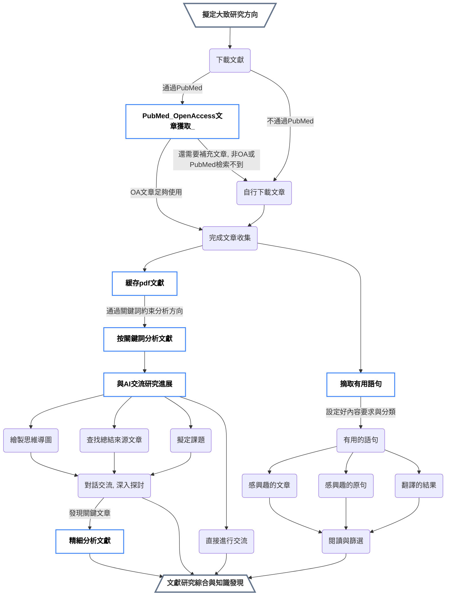

    

<h1 align="center">Scholar Navis</h1>

  

    一款基於 gpt_academic 的流水線式領域進展分析工具
     
    允許用戶從大量文章中提取有用的信息（例如研究進展、空白點以及符合用戶需求的句子），並且支持以用戶的母語顯示
  

  | [简体中文](README.md) | [繁体中文](readme-zh_Hant.md) | [English](readme-en_US.md) |

### 事先說明

本軟件基於 gpt_academic（3.83）開發，為其衍生作品。遵守 GNU Affero General Public License v3.0 許可證。詳細使用情況和修改內容，可以點擊[這裡](crazy_functions/scholar_navis/doc/zh-Hant/third-party-lisence.md)

### 簡單介紹

- 將文獻閱讀、了解研究領域進展等需求與 AI 整合的一款工具。Scholar Navis 是一款橫跨平台工具，可以同時分析總結多篇文獻、了解該領域的發展現狀、認識到這些文章的相似之處、創新點與不足，**並結合自身的知識**，開辟出新的研究方向，在综述的撰寫上也有一定的幫助。

- 可以從眾多文章中找到感興趣的文章，並對這篇文章或其他任何文章進行分析，進一步消化吸收該篇文章。

- 可以與單篇文章甚至大量文章進行對話，通過問答的形式，與 AI 探討研究細節。

- 透過處理上傳的文章，從而減少外界錯誤信息的獲取，在LLM模型的能力範圍內，盡可能地提高分析和對話的準確性。

- “Navis”在拉丁語中是“**船**”的意思，借助這艘船，開辟前人尚未發現的新大陸吧。

- 除gpt_academic內置的對話、學術功能之外，Scholar Navis 修改或新引入了多項功能。該工具包含有五個工具：[`PubMed OpenAccess文章獲取`](crazy_functions/scholar_navis/doc/zh-Hant/PubMed-Open-Access-Articles-Download.md)、[`緩存pdf文獻`](crazy_functions/scholar_navis/doc/zh-Hant/Cache-PDF-Articles.md)、[`按關鍵詞分析文獻`](crazy_functions/scholar_navis/doc/zh-Hant/Summarize-Articles-by-Keywords.md)、[`與AI交流研究進展`](crazy_functions/scholar_navis/doc/zh-Hant/Communicate-with-AI-about-Research-Progress.md)、[`精細分析文獻`](crazy_functions/scholar_navis/doc/zh-Hant/Fine-grained-Analysis-of-Article.md)，這五項功能組成了最主要的分析管線，是scholar navis目前最為重要的工作流程，幫助從一個廣泛的研究方向一次性了解多篇文章，再從這些文章中找到更有價值的文章，從中進行了解和學習；自定義語言輸出，模型分析過程中使用英語，輸出結果時使用目標語言，打破語言壁壘，快速獲取重要學術信息；基於大語言模型的本地化多語言支持；自定義提供商、API-KEY、模型功能；為一些需要訪問LLM或者是需要文獻信息、網絡請求的部分，設計了緩存機制，減少因為請求而產生的额外耗时；通過大語言模型的文字理解能力，更好的識別文章的doi、標題；自带文件清理機制，適時刪除過期文件。

- 此外，Scholar Navis 也有`摘取有用語句`功能，使用它可以很方便地從大量文章中摘取符合自己要求的語句（並提供翻譯，便於閱讀），對撰寫摘要、綜述和資料收集方面很有幫助。

### 設計初衷

- 許每人都能以低成本的價格使用高效能的 GPT 工具，無需擔心網絡和其他條件限制。

- 借助開源，基於 [gpt_academic](https://github.com/binary-husky/gpt_academic) 可以實現更多功能。

- 希望減少一些皮包公司的套殼 ChatGPT 的使用和濫用。

- 打破語言壁壘，深化學術交流。

- 為了盡可能減少 AI 空穴來風捏造現象，選擇將上傳的文獻作為 AI 分析的最主要依據。

- 協助研究者在更短時間內閱讀更多文獻，獲取有價值的資訊，拓展科學視野，並提升科研效率。

- 使用此工具，可以從確定研究方向開始，流水線式地下載文章，規劃題目，分析當前領域的研究現狀和缺口，發掘前人尚未研究的方向，對感興趣的文章進行精細摘要，對不清楚的地方進行提問並為之解答。

### 工具特色

- 開源。

- 本地化支援實現無縫語言切換，同時用戶可自由設定大語言模型的回應語言。

- 使用簡單。每個可能的使用場景均有其對應的說明文件。

- 支持中文和英語雙語言顯示。（GPT則支持多種語言，<b>**不同GPT對不同語言的支援能力有所不同，GPT的理解能力也會有差異**</b>）。

- 指令化。使用一些特定的指令，實現不同的功能。

- 梳理化。若干文章的總結分條展示，便於結合自身的經驗，考慮新穎的出發點和落腳點。

- 效率高、支持中斷。將十幾篇甚至幾十篇文章提供給人工智能是一個耗時的環節，通過分組優化，實現隨時中斷，下次從中斷的文章繼續分析。*部分功能支援*

- 文章尋找便捷。如果對導入的幾十篇文章中的幾個要點感興趣，可以詢問AI，AI會幫你找出包含該要點的所有文章。

- 協助規劃題目。從這些文獻中規劃一些有創新性的題目。

- 全方位分析文章，分條呈現總結內容。

- 更注重文章的創新性和缺陷。

- 使用緩存，減少訪問LLM大語言模型的次數，降低使用成本，加快處理速度。 

- 支持用户自定义API-KEY（支持OpenAI、智譜、通義千問、深度求索和月之暗面），支持自定义OpenAI的URL重定向，支持添加新的模型。

- 網絡服務：在線PDF瀏覽

- API服務：簡易維護提醒

- 借助 gpt_academic，得以實現以下功能：

> - 中文友好。對中國大陸進行優化，有完善的中文對話服務，有中文說明，支持網絡代理。此外也支持英文。
> - 沒有電腦性能要求。由於直接使用在線AI服務，所以並不需要高配備電腦就可以運行，只要能上網就可以使用（gpt_academic 也支持本地模型）。
> - 繪製思維導圖。借助 gpt_academic 的插件（生成多種 Mermaid 圖表 @Menghuan1918）可以繪製多種類型的思維導圖。
> - 通用。使用通用的LLM（大語言模型）即可，無需對模型進行微調。
> - 可控。AI的分析總結和對話，均基於上傳的文章、提供的關鍵詞、提示等可控的內容。
> - 低成本。使用如`deepseek-chat`、`moonshot-v1-8k`、`GLM-4-Flash`、`GLM-4-Air`、`qwen-turbo`、`ChatGPT-3.5 turbo`等价格相对低廉的模型即可完成几乎所有任务，因为这些模型总结分析的素材都來自您上传的内容，只要AI能夠理解，就可以使用。

### 免责聲明

- 基於簡體中文開發，翻譯均為LLM翻譯輔之人工修正。如有內容衝突，**一切內容以簡體中文版為準**

- 受限于AI的不確定性（就像人一樣，有時候會說錯話），對部分內容的總結可能不完全甚至不正確，存在理解偏差和翻譯出錯的可能。

- 即使是相同的文章，使用同一個AI，也有可能分析的結果不同

- 您需要知道的是，LLM（大語言模型）的效果深受訓練方式、參數、問答因素的等影響，<b>****輸出的內容可能不客觀、片面甚至錯誤****</b>。

- 一些原生英文的AI對於中文（或其他非英語語種）的理解能力可能較差。

- 当生成的内容不太滿足要求時，可以嘗試重新多試幾次。

- 部分功能需要多次請求模型。請確保模型的速率限制較為寬鬆，且餘額充足。

- 僅作為輔助工具，必須輔以必要的人工檢查和處理。<b>****我們不推薦在不加檢查、不加修正的情況下，直接採用AI輸出的結果。如果發生任何問題，Scholar Navis 作者及其所屬組織、語言模型提供商、gpt_academic及其有關或衍生內容不負任何責任。****</b>

- **聯網系統的信息安全無法得到充分保證，最好是個人或小組織內使用，以保證服務提供者可信，並且敏感信息最好不上傳。另外，當啟用登錄功能時，服務商能夠儲存您的API-key，不推薦使用來路不明、不受信任的服務商。**

- 您需要知道的是，AGPLv3提供了責任限制（版權人不對使用者在使用過程中造成的損失承擔任何責任），並不提供任何擔保（版權人也不對該軟件品質提供任何擔保）。如果您使用了本AI服務，則默認同意上述內容；否則，請勿使用。

### 安裝過程

#### 直接安裝

1. 直接下載本項目，並安裝好 Python。

> 對於 Windows 10 及其以上版本的使用者，也可以嘗試應用商店中的 Python。
> 如果還需要 Python 進行其他開發或運行其他應用，推薦使用 conda
> 如果您正在使用 Linux，相信您有能力自行解決安裝中出現的所有問題

2. 確保Python正常安裝後，根據`requirements.txt`完成安裝（通常使用命令 `pip install -r requirements.txt` 實現）。

#### Docker 安裝

        待補充...

#### 配置

1. 根據需要，自行修改`config_private.py`中的配置內容，或者是使用同名的環境變量進行配置。讀取優先級：環境變量 ＞ config_private.py ＞ config.py。config.py在每次更新時可能被覆蓋，不推薦在此文件中修改配置。

2. 此外，[docs](docs) 文件夾中含有多個 gpt_academic 的所有文檔，也可以查閱這些文檔（或訪問[GitHub 頁面](https://github.com/binary-husky/gpt_academic)），非常有益！

3. 也可以使用我們的在線服務。[簡體中文版（中國大陸優化）](https://cn.scholarnavis.com/)、[英文版](https://scholarnavis.com/)。二者除了顯示語言不同和伺服器所在地、線路不同外，其他功能均一致。 

### 使用教程

#### 對話部分

1. 運行 `main.py` 启用 gpt_academic，在打開的網頁的右側，應當能看到 Scholar Navis 的5個方塊，點擊後可以看到使用提示。 

2. 6個插件（[`PubMed OpenAccess文章獲取`](crazy_functions/scholar_navis/doc/zh-Hant/PubMed-Open-Access-Articles-Download.md)、[`緩存pdf文獻`](crazy_functions/scholar_navis/doc/zh-Hant/Cache-PDF-Articles.md)、[`按關鍵詞分析文獻`](crazy_functions/scholar_navis/doc/zh-Hant/Summarize-Articles-by-Keywords.md)、[`與AI交流研究進展`](crazy_functions/scholar_navis/doc/zh-Hant/Communicate-with-AI-about-Research-Progress.md)、[`精細分析文獻`](crazy_functions/scholar_navis/doc/zh-Hant/Fine-grained-Analysis-of-Article.md)和`摘取有用語句`）其均內置了簡潔的操作指南和功能作用，切換到該工具，`輔助指令` -> `help: 帮助文檔`即可查看。

3. 如果需要上傳文件，通常為先上傳再運行某個功能。

4. 此外，用戶也可以在左上角的`「API-KEY」`中輸入自己的密鑰，使用其他中轉服務商，或者是添加額外的自定義模型。

5. 當然，也可以使用 gpt_academic 其他的功能進行處理。如果覺得有用，最好可以給原項目一個 star！

#### 摘取有用語句

1. 使用該功能可以快速地從大量文章中摘取出想要的原文語句和翻譯後的語句，便於撰寫文章。

2. 頁面中有較為詳細的教程文字。通常情況下，上傳PDF（或PDF壓縮包，可選）、上傳額外的PDF（或壓縮包）、設定好針對摘取句子時的內容要求、設定好結構要求（可以理解成滿足內容要求的文本，在行文上的要求）、翻譯語言和最大並行數，即可執行。

3. 運行過程中，會不斷輸出日誌，當任務尚未結束時，日誌會有動畫指示。

4. 下載文件時，通常下載結果文件即可。

5. 當需要再次運行時，需要先重置。

#### 功能關係圖

### 開發者文檔

待補充...

### 版權信息

- Scholar Navis 遵守 AGPL-3.0 license 開源許可證。 

- 因為對 gpt_academic 進行了修改，根據 GPL-3.0 許可證的要求，亦需要發布修改後的源碼，並注明修改的内容。

- Scholar Navis 引用的所有第三方庫及其許可證信息，對 gpt_academic 的修改和使用，以及更加詳細的版權聲明，可以看[這裡](crazy_functions/scholar_navis/doc/zh-Hant/third-party-lisence.md)。

- 在網頁界面中，Scholar Naivs 功能可以透過輔助指令 `license` 查看許可證和其他第三方版權信息以及 gpt_academic 修改信息；同時也可以使用 `about` 查看關於文件的說明。
