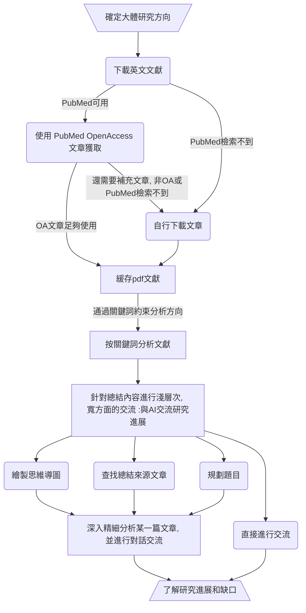

<h1 align="center">
<b>Scholar Navis</b>
</h1>

<i>一款基于 gpt_academic 的流水线式领域进展分析工具</i>

| [简体中文](README.md) | [繁体中文](readme-zh_Hant.md) | [English](readme-en_US.md) |

### 事先說明

本軟件基於 gpt_academic（3.83）開發，作為其一款插件執行跨平台任務的前沿分析工具。因為對 gpt_academic 的源碼發生了小幅度的修改（主要是使其能夠調用 Scholar Navis），為遵守 GNU 通用公共许可证第 3.0 版許可證，本庫中亦包含 gpt_academic 的代碼。詳細使用情況和修改內容，可以點擊[這裡](crazy_functions/scholar_navis/doc/zh-Hant/third-party-lisence.md)

### 簡單介紹

- 將文獻閱讀、了解研究領域進展等需求與 AI 整合的一款工具。與市面上商業化工具不同，該工具可以以更低的成本完成更加精準的分析，了解前人的經驗，探索尚未研究過的領域。

- “Navis”在拉丁語中是“**船**”的意思，借助這艘船，開辟前人尚未發現的新大陸吧。

- 該工具包含有五個工具：`缓存 pdf 文獻`、`按關鍵詞分析文獻`、`與 AI 交流研究進展`、`精細分析文獻`與`PubMed OpenAccess 文章獲取`，幫助從一個寬泛的研究方向一次性了解多篇文章，再從這些文章中找到更有價值的文章，從中進行了解和學習。

### 設計初衷

- 許每人都能以低成本的價格使用高效能的 GPT 工具，無需擔心網絡和其他條件限制。

- 借助開源，基於 [gpt_academic](https://github.com/binary-husky/gpt_academic) 可以實現更多功能。

- 希望減少一些皮包公司的套殼 ChatGPT 的使用和濫用。

- 為了盡可能減少 AI 空穴來風捏造現象，選擇將上傳的文獻作為 AI 分析的最主要依據。

- 使用此工具，可以從確定研究方向開始，流水線式地下載文章，規劃題目，分析當前領域的研究現狀和缺口，發掘前人尚未研究的方向，對感興趣的文章進行精細摘要，對不清楚的地方進行提問並為之解答。

### 工具特色

- 開源。

- 使用簡單。每個可能的使用場景均有其對應的說明文件。

- 支持中文和英語雙語言顯示。（GPT則支持多種語言，<b>**不同GPT對不同語言的支援能力有所不同，GPT的理解能力也會有差異**</b>）可以使用 `multi_language.py` 自行翻譯 gpt_academic **（請先翻譯，再安裝 Scholar Navis）**。此外，非簡體中文語言可能會有無法點擊“提交”按鈕的問題，此時可以打開`界面外觀 -> 漂浮輸入區`進行暂时性的替代。該問題尚不清楚如何修復。

- 指令化。使用一些特定的指令，實現不同的功能。

- 梳理化。若干文章的總結分條展示，便於結合自身的經驗，考慮新穎的出發點和落腳點。

- 效率高、支持中斷。將十幾篇甚至幾十篇文章提供給人工智能是一個耗時的環節，通過分組優化，實現隨時中斷，下次從中斷的文章繼續分析。*部分功能支援*

- 文章尋找便捷。如果對導入的幾十篇文章中的幾個要點感興趣，可以詢問AI，AI會幫你找出包含該要點的所有文章。

- 協助規劃題目。從這些文獻中規劃一些有創新性的題目。

- 全方位分析文章，分條呈現總結內容。

- 更注重文章的創新性和缺陷。

- 使用緩存，減少訪問LLM大語言模型的次數，降低使用成本，加快處理速度。

- 借助 gpt_academic，得以實現以下功能：

> - 中文友好。對中國大陸進行優化，有完善的中文對話服務，有中文說明，支持網絡代理。此外也支持英文。
> - 沒有電腦性能要求。由於直接使用在線AI服務，所以並不需要高配備電腦就可以運行，只要能上網就可以使用（gpt_academic 也支持本地模型）。
> - 繪製思維導圖。借助 gpt_academic 的插件（生成多種 Mermaid 圖表 @Menghuan1918）可以繪製多種類型的思維導圖。
> - 通用。使用通用的LLM（大語言模型）即可，無需對模型進行微調。
> - 可控。AI的分析總結和對話，均基於上傳的文章、提供的關鍵詞、提示等可控的內容。
> - 低成本。使用`moonshot-v1-32k`、`GLM-4-Flash`、`GLM-4-Air`、`qwen-turbo`、`ChatGPT-3.5 turbo`等價格相對低廉的模型即可完成几乎所有任務，因為他們總結分析的材料均來自您上傳的內容，只要AI能夠看懂，就可以使用。 

### 免责聲明

- 基於簡體中文開發，翻譯均為LLM翻譯輔之人工修正。如有內容衝突，**一切內容以簡體中文版為準**

- 受限于AI的不確定性（就像人一樣，有時候會說錯話），對部分內容的總結可能不完全甚至不正確，存在理解偏差和翻譯出錯的可能。

- 即使是相同的文章，使用同一個AI，也有可能分析的結果不同

- 您需要知道的是，LLM（大語言模型）的效果深受訓練方式、參數、問答因素的等影響，<b>****輸出的內容可能不客觀、片面甚至錯誤****</b>。

- 一些原生英文的AI對於中文（或其他非英語語種）的理解能力可能較差。

- 当生成的内容不太滿足要求時，可以嘗試重新多試幾次。

- 僅作為輔助工具，必須輔以必要的人工檢查和處理。<b>****我們不推薦在不加檢查、不加修正的情況下，直接採用AI輸出的結果。如果發生任何問題，Scholar Navis 作者及其所屬組織、語言模型提供商、gpt_academic及其有關或衍生內容不負任何責任。****</b>

### 安裝過程

1. 直接下載本項目，並安裝好 Python。

> 對於 Windows 10 及其以上版本的使用者，也可以嘗試應用商店中的 Python。
> 如果還需要 Python 進行其他開發或運行其他應用，推薦使用 conda
> 如果您正在使用 Linux，相信您有能力自行解決安裝中出現的所有問題

2. 確保 Python 正常安裝後，運行 `setup.py` 即可完成配置與安裝（通常情況下已經安裝完成）。配置過程中，主要是對於顯示語言和 GPT 偏好語言進行設置（GPT 偏好語言在程序中也可以進行選擇）

3. 根據需要，自行修改 `config_private.py` 中的配置內容，尤其是 `API_KEY`（含其他提供商的），並將該 API 所需的模型填寫到 `AVAIL_LLM_MODELS` 中。具體操作說明可以參考[項目配置說明](https://github.com/binary-husky/gpt_academic/wiki/%E9%A1%B9%E7%9B%AE%E9%85%8D%E7%BD%AE%E8%AF%B4%E6%98%8E)

4. 如果您需要將 Scholar Navis 安裝到其他 gpt_academic 中，可以将 `scholar_navis` 文件夾移動到 `crazy_functions` 中，並運行安裝程序 `setup.py`；如果安裝程序運行異常、或安裝後無法正常運行，可以參考對於 `config_private.py` 和 `crazy_functional.py` 的修改，自行安裝，並手動安裝相關依賴庫。

5. 此外，[docs](docs) 文件夾中含有多個 gpt_academic 的所有文檔，也可以查閱這些文檔（或訪問[GitHub 頁面](https://github.com/binary-husky/gpt_academic)），非常有益！

6. 關於 gpt_academic 的其他語言選項：可以參考 [gpt_academic/multi_language.py](https://github.com/binary-husky/gpt_academic/blob/master/multi_language.py) 或使用其他已經翻譯完成的 gpt_academic（Scholar Navis 對 gpt_academic 的修改相當少，可以輕鬆進行移植）。

### 使用教程

1. 運行 `main.py` 启用 gpt_academic，在打開的網頁的右側，應當能看到 Scholar Navis 的5個方塊，點擊後可以看到使用提示。 

2. 5個插件（`PubMed OpenAccess文章獲取`、`緩存pdf文獻`、`按關鍵詞分析文獻`、`與AI交流研究進展`、`精細分析文獻`）其均內置了簡潔的操作指南和功能作用，切換到該工具，`輔助指令` -> `help: 帮助文檔`即可查看。

3. 作為一種流水線式工具，一般而言的使用流程為（共四大步，每個功能前均有編號）：

4. 如果需要上傳文件，通常為先上傳再運行某個功能。

5. 當然，也可以使用 gpt_academic 其他的功能進行處理。如果覺得有用，最好可以給原項目一個 star！

### 簡易開發者文檔

**在 `crazy_functions\scholar_navis` 文件夾中，除了運行 Scholar Navis 正常運行所需的腳本外，還有以下的文件（夹）：data、i18n、config.yml 和 version。使用過程中如果遇到一些問題，或者是其他情況，可以對這裡進行調整**

- data：運行過程中，儲存著 PubMed 下載的文章，doi 與文章標題對應數據庫（article_doi_title.db）、AI 閱讀全文緩存數據庫（doi_fulltext_ai_understand.db）。當內容不相符或出現嚴重問題時，可以嘗試刪除此文件夾或其中某個文件。

- 下載的文章：位於 `data\pubmedOA_download`。僅用於儲存使用內置工具下載的文章，減少不必要的重複下載（當該文件夾中存在名為 PMCID 的 pdf 文件時，則下載器跳過下載，直接使用該緩存）

- article_doi_title.db：位於 `data\db`。儲存著所有由 PubMed 下載器、元數據讀取、AI 辅助獲取、正則表達式獲取的 doi 和標題的對應關係。用於在展示文章時，輸出文章標題，並提供跳轉到文章發布頁的功能。當數據庫中有儲存時，會跳過對 doi 和 title 的獲取和解析。

- doi_fulltext_ai_understand.db：位於 `data\db`。儲存著精細分析文章時，AI 閱讀文章的內容。當精細分析文章的 doi 命中時，則直接使用緩存的内容，減少訪問 LLM 的次數

- i18n：`gettext` 所需的國際化文本（僅限於 Scholar Navis，不適用於 gpt_academic）。

- config.yml：儲存著 GPT 偏好語言和顯示語言設定。

- version：儲存著版本號。

**用戶上傳的文章、分析過程中產生的各類文件和緩存，均儲存在 `gpt_log` 中**

- gpt_academic 支持多用戶，如果沒有設置用戶，則所有的處理均以 `default_user` 用戶進行。
- `gpt_log\ {用户名} \scholar_navis` 中儲存着產生的各類總結庫。總結庫為進行某一領域方向分析的一個單位。
- `gpt_log\ {用户名} \scholar_navis\tmp`：該用戶運行過程中產生的緩存。每次執行功能之前，均會清除該用戶下的所有緩存。
- 總結庫 `cache` 文件夾：儲存着新導入的、尚未進行預分析（按照指定的關鍵詞分析文章摘要）、未進行總結的文章，但是他們可能已經進行了預處理（即有同名的 yml 文件，獲取 doi 和標題）。
- 總結庫 `repository` 文件夾：儲存着所有已經處理完成的文章。
- 總結庫 `summarization.pdf/txt`：儲存着按照指定關鍵詞分析的结果。pdf僅用於展示給用戶，後續如果需要用到分析結果，只會用 `summarization.txt`
- 總結庫 `lib_manifest.yml`：儲存着該總結庫的名稱、關鍵詞和該總結庫生成時 Scholar Navis 的版本號。總結库名稱應當與所在文件夾一致。

### 版權信息

- Scholar Navis 遵守 GPL-3.0 license 開源許可證。

- 截至目前为止，Scholar Navis 本質上是 [gpt_academic](https://github.com/binary-husky/gpt_academic) 的一个插件，無法獨立使用。特別感謝 gpt_academic 提供了一個強大的模塊化平台。

- 因為對 gpt_academic 進行了修改，根據 GPL-3.0 許可證的要求，亦需要發布修改後的源碼，並注明修改的内容。

- Scholar Navis 引用的所有第三方庫及其許可證信息，對 gpt_academic 的修改和使用，以及更加詳細的版權聲明，可以看[這裡](crazy_functions/scholar_navis/doc/zh-Hant/third-party-lisence.md)。
